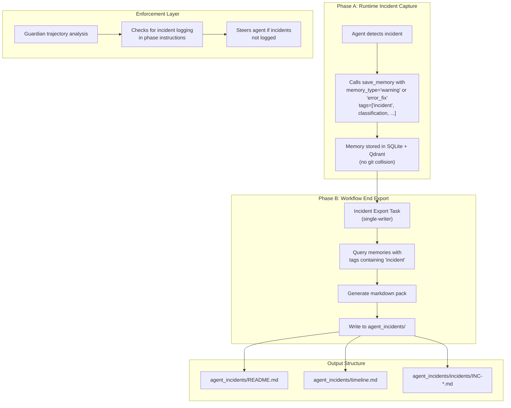
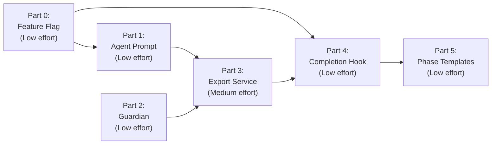

# Incident Logging Implementation Plan

## Memory-First Approach for Hephaestus

**Author**: Architect Mode
**Date**: 2026-01-13
**Updated**: 2026-01-14 (Added feature flagging)
**Status**: ✅ Complete - Parts 0-4 Implemented, Part 5 Deferred

---

## Reference Documents

- **Agent Incident Logging Prompt**: [`src/prompts/agent_incident_logging.md`](../src/prompts/agent_incident_logging.md) — The complete prompt with exact formats, rules, and templates that agents should follow

---

## Executive Summary

This plan implements incident logging using Hephaestus's existing `save_memory` MCP tool. Agents log incidents as memories during runtime (zero file collision risk due to database storage), and a workflow-end export task produces the markdown incident pack in `agent_incidents/`.

### Why Memory-First?

| Approach | Pros | Cons |
|----------|------|------|
| **Memory-First** ✅ | Uses existing infrastructure; no git collisions; minimal code | Incidents not visible as files mid-run |
| File-First with per-agent folders | Visible mid-run | Requires new file structures; merge complexity |
| Results-First | Built-in validation UI | Schema changes; more complex |

Memory-First wins because:
1. **No worktree collision risk** — memories go to SQLite/Qdrant, not git files
2. **Minimal new code** — leverages existing `save_memory` MCP tool
3. **Guardian can enforce** — phase instructions are already checked

---

## Architecture Overview



---

## Part 0: Feature Flag Configuration

### Objective
Add a feature flag to enable/disable incident logging system-wide, following the existing pattern in Hephaestus configuration.

### Files to Modify
- `src/core/simple_config.py` — add incident_logging config section
- `hephaestus_config.yaml` — add default configuration

### Pattern Reference
Follows existing feature flag patterns (see lines 88-159 in `simple_config.py`):
```python
# Existing pattern examples:
self.monitoring_enabled = monitoring.get('enabled', True)
self.diagnostic_agent_enabled = diagnostic.get('enabled', True)
self.ticket_tracking_enabled = ticket_tracking.get('enabled', True)
```

### Changes Required

#### 1. `src/core/simple_config.py` — Add in `_apply_yaml_config` method (after line 159):

```python
# Incident logging settings
incident_logging = config.get('incident_logging', {})
self.incident_logging_enabled = incident_logging.get('enabled', True)
self.incident_logging_output_dir = incident_logging.get('output_dir', 'agent_incidents')
```

#### 2. `src/core/simple_config.py` — Add in `_load_env_overrides` method (after line 296):

```python
if os.getenv("INCIDENT_LOGGING_ENABLED"):
    self.incident_logging_enabled = os.getenv("INCIDENT_LOGGING_ENABLED").lower() == "true"
```

#### 3. `hephaestus_config.yaml` — Add configuration section:

```yaml
incident_logging:
  enabled: true
  output_dir: agent_incidents
```

### Acceptance Criteria
- [x] `config.incident_logging_enabled` returns boolean
- [x] `config.incident_logging_output_dir` returns string path
- [x] Environment variable `INCIDENT_LOGGING_ENABLED` can override
- [x] Default is `enabled: true` (opt-out rather than opt-in)

---

## Part 1: Agent Prompt Enhancement

### Objective
Add incident logging instructions to the base agent prompt so all agents know how and when to log incidents.

### Files to Modify
- `src/agents/manager.py` lines 556-658 — the `IMPORTANT INSTRUCTIONS` and `MEMORY GUIDELINES` sections

### Reference Prompt
The complete incident logging prompt is defined in [`src/prompts/agent_incident_logging.md`](../src/prompts/agent_incident_logging.md). This file contains:
- What counts as an incident (5 categories)
- Timeline entry format
- Incident report template
- File structure and naming conventions
- Hygiene and security rules

### Changes Required

Add a new section after the existing `MEMORY GUIDELINES` (around line 658) that includes the key elements from the reference prompt.

**IMPORTANT**: Wrap the entire section with a feature flag check:

```python
# Check feature flag before adding incident logging section
if self.config.incident_logging_enabled:
    base_message += """
7. **INCIDENT LOGGING** - Capturing Operational Problems:

   **What counts as an incident (MUST log):**
   1) A command fails (non-zero exit) OR produces an error that changes your plan
   2) You realize you were in wrong context (wrong directory, worktree, branch, venv)
   3) You waste time due to avoidable misunderstanding (path confusion, missing dependency)
   4) You need more than one attempt to get a basic prerequisite working
   5) You notice a recurring "agent trap" even if caught quickly

   **How to log incidents:**
   ```python
   save_memory(
       ai_agent_id="<your agent ID>",
       memory_content="INCIDENT: <short title> | symptom: <what happened> | attempted: <what you tried> | status: OPEN|TENTATIVE|VERIFIED | verify: <command/check>",
       memory_type="warning",  # or "error_fix" if resolved
       tags=["incident", "<classification>", ...],
       related_files=["<relevant files>"]
   )
   ```

   **Classifications** (pick one primary):
   - `dependency` - missing package, wrong version
   - `pathing` - wrong directory, path confusion
   - `repo_state` - wrong branch, uncommitted changes
   - `tooling` - tool usage error, wrong command
   - `permissions` - access denied, sudo required
   - `config` - misconfiguration, env vars missing
   - `test_failure` - tests failing unexpectedly
   - `runtime` - runtime errors, crashes

   **Status meanings:**
   - `OPEN` - don't know the fix yet
   - `TENTATIVE` - tried something, not verified
   - `VERIFIED` - ran verification command, confirmed fixed

   **When to log:** Log DURING the run, not at the end. Quick ~30 seconds per incident.
```

### Acceptance Criteria
- [ ] Agents can call `save_memory` to log incidents without new MCP tools
- [ ] Incident memories distinguishable via `incident` tag
- [ ] Format is parseable by export service

---

## Part 2: Guardian Enforcement

### Objective
Enable Guardian to detect when agents encounter incidents but fail to log them.

### Files to Modify
- `src/prompts/guardian_trajectory_analysis.md` lines 130-164 — add incident detection rules

### Changes Required

Add new section in "How to Use Phase Context in Trajectory Analysis":

```markdown
### Incident Logging Detection

**Watch for unlogged incidents in tmux output:**

Indicators that an incident occurred:
- Non-zero exit codes followed by retry
- Error messages: "command not found", "module not found", "permission denied"
- Agent corrections: "wrong path", "let me try again", "that didn't work"
- Multiple attempts at same operation

**Violation Pattern - Unlogged Incident:**

❌ Agent hits error, retries, succeeds — but didn't call save_memory with 'incident' tag:
- This is `violating_constraints`
- Steering: "You encountered an operational issue ([brief description]). Please log this as an incident using save_memory with tags=['incident', '<classification>']."

**NOT a violation:**
- Single-attempt debugging (normal workflow)
- Agent already logged the incident
- Minor typos corrected immediately

**Evaluation:**
- If agent has 2+ retry attempts for same issue → check for incident logging
- If no save_memory call with 'incident' tag found → needs_steering: true
```

### Acceptance Criteria
- [ ] Guardian identifies when agents encounter incident-worthy events
- [ ] Guardian steers agents to log incidents they missed
- [ ] No false positives for normal debugging

---

## Part 3: Incident Export Service

### Objective
Create a service that queries incident memories and generates the markdown pack.

### New File
`src/services/incident_export_service.py`

### Implementation

```python
"""Service for exporting incident memories to markdown files."""

import os
import re
import logging
from datetime import datetime
from typing import List, Dict, Any, Optional

from src.core.database import get_db, Memory, Agent

logger = logging.getLogger(__name__)


class IncidentExportService:
    """Exports incident memories to markdown format at workflow end."""
    
    @staticmethod
    def export_all(workflow_id: str, output_dir: str = "agent_incidents") -> Dict[str, Any]:
        """Export all incidents for a workflow to markdown files.
        
        Args:
            workflow_id: The workflow to export incidents for
            output_dir: Directory to write incident files (default: agent_incidents/)
            
        Returns:
            Dict with export statistics
        """
        # Ensure output directories exist
        os.makedirs(output_dir, exist_ok=True)
        os.makedirs(os.path.join(output_dir, "incidents"), exist_ok=True)
        
        # Query incident memories
        incidents = IncidentExportService._query_incidents(workflow_id)
        
        # Generate files
        timeline_path = IncidentExportService._export_timeline(incidents, output_dir)
        incident_files = IncidentExportService._export_incident_reports(incidents, output_dir)
        readme_path = IncidentExportService._export_index(incidents, incident_files, output_dir)
        
        return {
            "total_incidents": len(incidents),
            "timeline_path": timeline_path,
            "incident_files": incident_files,
            "readme_path": readme_path,
        }
    
    @staticmethod
    def _query_incidents(workflow_id: str) -> List[Dict[str, Any]]:
        """Query all memories with 'incident' tag for this workflow."""
        session = get_db()
        try:
            # Get all agents for this workflow
            agents = session.query(Agent).filter(
                Agent.workflow_id == workflow_id
            ).all()
            agent_ids = [a.id for a in agents]
            
            # Query memories with 'incident' in tags
            memories = session.query(Memory).filter(
                Memory.agent_id.in_(agent_ids)
            ).order_by(Memory.created_at).all()
            
            # Filter to only incident-tagged memories
            incidents = []
            for mem in memories:
                tags = mem.tags or []
                if "incident" in tags:
                    incidents.append({
                        "id": mem.id,
                        "agent_id": mem.agent_id,
                        "content": mem.content,
                        "memory_type": mem.memory_type,
                        "tags": tags,
                        "related_files": mem.related_files or [],
                        "created_at": mem.created_at,
                    })
            
            return incidents
        finally:
            session.close()
    
    @staticmethod
    def _parse_incident_content(content: str) -> Dict[str, str]:
        """Parse structured incident content into components."""
        result = {
            "title": "Unknown Incident",
            "symptom": "",
            "attempted": "",
            "status": "OPEN",
            "verify": "",
        }
        
        # Try to parse "INCIDENT: title | symptom: ... | ..." format
        if content.startswith("INCIDENT:"):
            parts = content.split("|")
            for part in parts:
                part = part.strip()
                if part.startswith("INCIDENT:"):
                    result["title"] = part.replace("INCIDENT:", "").strip()
                elif part.startswith("symptom:"):
                    result["symptom"] = part.replace("symptom:", "").strip()
                elif part.startswith("attempted:"):
                    result["attempted"] = part.replace("attempted:", "").strip()
                elif part.startswith("status:"):
                    result["status"] = part.replace("status:", "").strip()
                elif part.startswith("verify:"):
                    result["verify"] = part.replace("verify:", "").strip()
        else:
            # Fallback: use entire content as description
            result["title"] = content[:50] + "..." if len(content) > 50 else content
            result["symptom"] = content
        
        return result
    
    @staticmethod
    def _generate_slug(title: str) -> str:
        """Generate kebab-case slug from title."""
        slug = title.lower()
        slug = re.sub(r'[^a-z0-9\s-]', '', slug)
        slug = re.sub(r'[\s_]+', '-', slug)
        slug = re.sub(r'-+', '-', slug)
        slug = slug.strip('-')
        return slug[:40]  # Limit length
    
    @staticmethod
    def _get_next_incident_id(output_dir: str) -> int:
        """Scan existing INC-*.md files and return next ID."""
        incidents_dir = os.path.join(output_dir, "incidents")
        if not os.path.exists(incidents_dir):
            return 1
        
        max_id = 0
        for filename in os.listdir(incidents_dir):
            if filename.startswith("INC-") and filename.endswith(".md"):
                try:
                    id_str = filename.split("-")[1]
                    id_num = int(id_str)
                    max_id = max(max_id, id_num)
                except (IndexError, ValueError):
                    continue
        
        return max_id + 1
    
    @staticmethod
    def _export_timeline(incidents: List[Dict], output_dir: str) -> str:
        """Generate timeline.md with one line per incident."""
        timeline_path = os.path.join(output_dir, "timeline.md")
        
        with open(timeline_path, "w") as f:
            f.write("# Incident Timeline\n\n")
            f.write("| Timestamp | Title | Status | Agent | Tags |\n")
            f.write("|-----------|-------|--------|-------|------|\n")
            
            for inc in incidents:
                parsed = IncidentExportService._parse_incident_content(inc["content"])
                timestamp = inc["created_at"].strftime("%Y-%m-%d %H:%M UTC")
                agent_short = inc["agent_id"][:8]
                tags = ", ".join(t for t in inc["tags"] if t != "incident")
                
                f.write(f"| {timestamp} | {parsed['title'][:40]} | {parsed['status']} | {agent_short} | {tags} |\n")
        
        return timeline_path
    
    @staticmethod
    def _export_incident_reports(incidents: List[Dict], output_dir: str) -> List[str]:
        """Generate INC-NNNN-slug.md for each incident."""
        incident_files = []
        next_id = IncidentExportService._get_next_incident_id(output_dir)
        
        for i, inc in enumerate(incidents):
            parsed = IncidentExportService._parse_incident_content(inc["content"])
            slug = IncidentExportService._generate_slug(parsed["title"])
            inc_id = f"INC-{next_id + i:04d}"
            filename = f"{inc_id}-{slug}.md"
            filepath = os.path.join(output_dir, "incidents", filename)
            
            # Determine classification from tags
            classifications = [t for t in inc["tags"] if t not in ["incident"]]
            classification = classifications[0] if classifications else "unknown"
            
            with open(filepath, "w") as f:
                f.write(f"""---
id: {inc_id}
status: {parsed['status']}
timestamp_opened: {inc['created_at'].isoformat()}
severity: MEDIUM
classification: {classification}
tags: {inc['tags']}
agent_id: {inc['agent_id']}
---

# Summary

{parsed['title']}

# Symptoms

{parsed['symptom']}

# Resolution Attempted

{parsed['attempted']}

# Verification

{parsed['verify']}

# Related Files

{chr(10).join('- ' + f for f in inc['related_files']) if inc['related_files'] else 'None recorded'}

# Raw Memory Content

```
{inc['content']}
```
""")
            incident_files.append(filename)
        
        return incident_files
    
    @staticmethod
    def _export_index(incidents: List[Dict], incident_files: List[str], output_dir: str) -> str:
        """Generate README.md with index and statistics."""
        readme_path = os.path.join(output_dir, "README.md")
        
        # Calculate stats
        by_status = {}
        by_classification = {}
        for inc in incidents:
            parsed = IncidentExportService._parse_incident_content(inc["content"])
            status = parsed["status"]
            by_status[status] = by_status.get(status, 0) + 1
            
            classifications = [t for t in inc["tags"] if t != "incident"]
            for c in classifications:
                by_classification[c] = by_classification.get(c, 0) + 1
        
        with open(readme_path, "w") as f:
            f.write("# Agent Incidents\n\n")
            f.write(f"**Total Incidents**: {len(incidents)}\n\n")
            
            f.write("## Statistics\n\n")
            f.write("### By Status\n")
            for status, count in sorted(by_status.items()):
                f.write(f"- {status}: {count}\n")
            
            f.write("\n### By Classification\n")
            for classification, count in sorted(by_classification.items()):
                f.write(f"- {classification}: {count}\n")
            
            f.write("\n## Incident Index\n\n")
            for filename in incident_files:
                f.write(f"- [incidents/{filename}](incidents/{filename})\n")
            
            f.write("\n## Timeline\n\n")
            f.write("See [timeline.md](timeline.md) for chronological view.\n")
        
        return readme_path
```

### Acceptance Criteria
- [x] Service can be called from workflow completion handler
- [x] Output matches format specified in prompt
- [x] Handles zero incidents gracefully

---

## Part 4: Workflow Completion Hook

### Objective
Trigger incident export when workflows complete, respecting the feature flag.

### Files to Modify
- `src/workflow/completion_handler.py` line ~22

### Changes Required

Add incident export step in the `complete_workflow` method, with feature flag check:

```python
from src.services.incident_export_service import IncidentExportService
from src.core.simple_config import get_config

# In complete_workflow method, after workflow marked complete:
config = get_config()
if config.incident_logging_enabled:
    try:
        export_result = IncidentExportService.export_all(
            workflow_id=workflow_id,
            output_dir=config.incident_logging_output_dir
        )
        logger.info(
            f"Exported {export_result['total_incidents']} incidents to "
            f"{export_result['readme_path']}"
        )
    except Exception as e:
        logger.warning(f"Failed to export incidents (non-blocking): {e}")
else:
    logger.debug("Incident logging disabled, skipping export")
```

### Acceptance Criteria
- [x] Export only runs when `config.incident_logging_enabled` is True
- [x] Uses `config.incident_logging_output_dir` for output path
- [x] Every completed workflow produces incident pack (when enabled)
- [x] Export happens automatically
- [x] Failures are logged but non-blocking

---

## Part 5: Phase Instructions Template

### Objective
Provide reusable template for phase definitions that includes incident logging.

### Files to Modify
- Example workflows in `example_workflows/`

### Changes Required

Add to `done_definitions` in phase templates:

```python
done_definitions=[
    # ... existing definitions ...
    "Log any operational incidents via save_memory with tags=['incident', ...]",
],
```

Add to `additional_notes`:

```python
═══════════════════════════════════════════════════════════════════════
⚠️ INCIDENT LOGGING (MANDATORY)
═══════════════════════════════════════════════════════════════════════

If you encounter ANY of these during your work:
- Command failures requiring retry
- Wrong directory/path issues
- Missing dependencies
- Permission problems
- Configuration issues

You MUST log them using save_memory:

```python
save_memory(
    ai_agent_id="[YOUR AGENT ID]",
    memory_content="INCIDENT: <title> | symptom: <what> | attempted: <fix> | status: VERIFIED | verify: <command>",
    memory_type="warning",
    tags=["incident", "<classification>"]
)
```

This takes ~30 seconds and helps future agents avoid the same issues.
```

### Acceptance Criteria
- [ ] New workflows include incident logging by default
- [ ] Guardian can enforce done_definition requirement

---

## Implementation Order



| Part | Effort | Files Changed | Description | Status |
|------|--------|---------------|-------------|--------|
| Part 0 | Low | 2 files | Feature flag configuration | ✅ Complete |
| Part 1 | Low | 1 file | Agent prompt enhancement | ✅ Complete |
| Part 2 | Low | 1 file | Guardian detection rules | ✅ Complete |
| Part 3 | Medium | 1 new file | Export service implementation | ✅ Complete |
| Part 4 | Low | 1 file | Completion hook integration | ✅ Complete |
| Part 5 | Low | Multiple | Phase template updates | ⏳ Pending |

---

## Testing Strategy

### Unit Tests

```python
# tests/test_incident_export_service.py

def test_parse_incident_content():
    """Test structured content parsing."""
    content = "INCIDENT: Wrong path | symptom: cd failed | attempted: used git rev-parse | status: VERIFIED | verify: pwd"
    result = IncidentExportService._parse_incident_content(content)
    assert result["title"] == "Wrong path"
    assert result["status"] == "VERIFIED"

def test_generate_slug():
    """Test slug generation."""
    assert IncidentExportService._generate_slug("Wrong Repo Root!") == "wrong-repo-root"

def test_export_empty_incidents():
    """Test graceful handling of zero incidents."""
    result = IncidentExportService.export_all("fake-workflow", "/tmp/test")
    assert result["total_incidents"] == 0
```

### Integration Test

1. Start a workflow with an agent that intentionally hits an error
2. Verify agent logs incident via `save_memory`
3. Complete workflow
4. Verify `agent_incidents/` directory created
5. Verify contents match expected format

### Guardian Test

1. Simulate tmux output showing unlogged incident
2. Verify Guardian detects and steers

---

## File Output Structure

After workflow completion:

```
agent_incidents/
├── README.md           # Index with stats and links
├── timeline.md         # Chronological one-liner per incident
└── incidents/
    ├── INC-0001-wrong-repo-root.md
    ├── INC-0002-poetry-install-fails.md
    └── INC-0003-path-confusion.md
```

---

## Rollout Plan

1. **Phase 1**: Implement Parts 1-3 (agent can log, export works)
2. **Phase 2**: Implement Part 4 (automatic export on completion)
3. **Phase 3**: Update example workflows with Part 5
4. **Phase 4**: Monitor and tune Guardian detection rules

---

## Open Questions

1. **Memory type**: Should we add a new `incident` memory type, or reuse `warning`/`error_fix`?
   - *Recommendation*: Reuse existing types, distinguish via `incident` tag

2. **Export trigger**: Should export also happen on workflow failure/termination?
   - *Recommendation*: Yes, incidents are especially valuable when workflows fail

3. **Retention**: Should incident memories be kept longer than regular memories?
   - *Recommendation*: Same retention; incidents are regular memories with special tags
