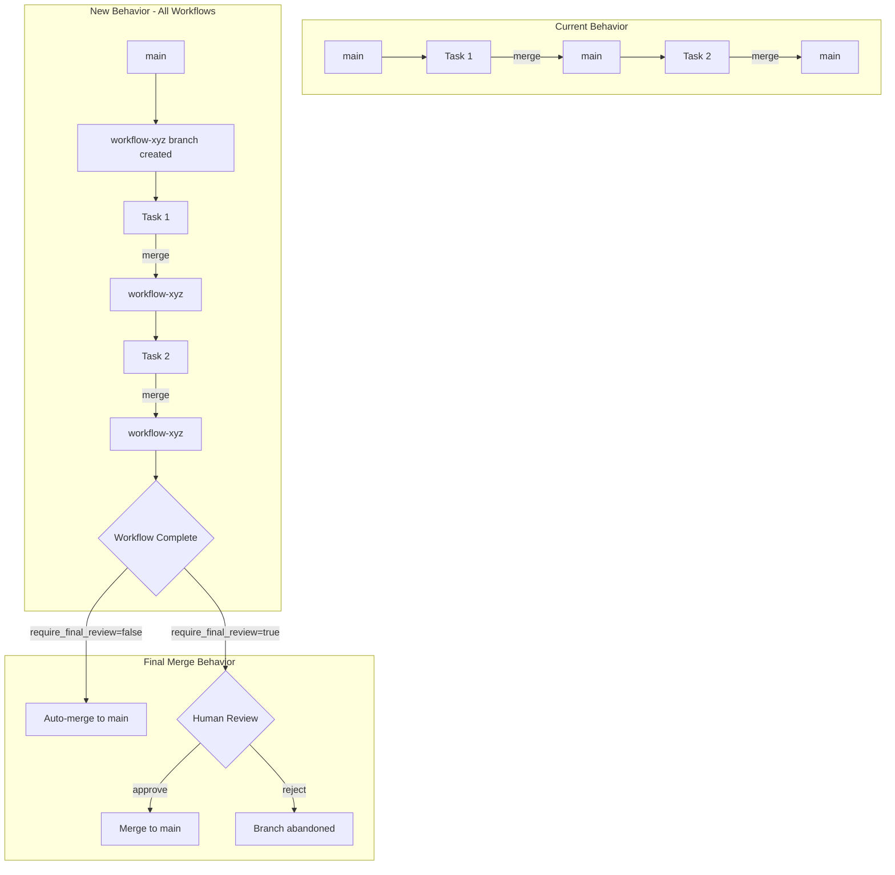
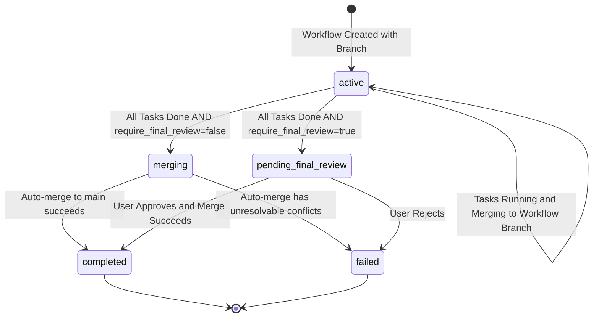

# Workflow Diff Review Feature

## Problem Statement

Currently, each task's work merges directly to `main` immediately upon completion. This has two issues:
1. Partial/incomplete work affects `main` before the workflow finishes
2. No opportunity to review the consolidated changes before they land in `main`

## Design Decision

**Two separate changes:**

1. **Workflow branch isolation (always)**: Every workflow creates a dedicated branch from `main` at start. All task merges target this workflow branch. This provides isolation regardless of review preference.

2. **Final merge review (feature flag)**: The `require_final_review` flag controls ONLY whether the final merge of the workflow branch back to `main` is automatic or requires human approval.

**Why this separation:**
- Branch isolation is a structural improvement for all workflows
- Review requirement is a policy choice per-environment
- Cleaner mental model: one flag, one behavior
- Task dependencies still work (each branches from the workflow branch which accumulates prior work)

---

## Architecture Overview

---

## Component Changes

### 1. Configuration

**File**: [`hephaestus_config.yaml`](../hephaestus_config.yaml)

Add under `git:` section:
- `require_final_review`: boolean flag (default: false) - enables the feature
- `workflow_branch_prefix`: string (default: "workflow-") - prefix for branch names

**File**: [`src/sdk/config.py`](../src/sdk/config.py)

Add corresponding fields to `HephaestusConfig` dataclass.

---

### 2. Database Schema

**File**: [`src/core/database.py`](../src/core/database.py)

Add to `Workflow` model:
- **workflow_branch_name**: String - name of the workflow's dedicated branch
- **workflow_branch_created**: Boolean - whether branch has been created
- **final_merge_status**: Enum - tracks review state: not_applicable, pending_review, approved, merged, rejected
- **final_merge_reviewed_at**: DateTime - when review decision was made
- **final_merge_reviewed_by**: String - who made the decision
- **final_merge_commit_sha**: String - the merge commit after approval

---

### 3. WorktreeManager

**File**: [`src/core/worktree_manager.py`](../src/core/worktree_manager.py)

New responsibilities:

1. **Create workflow branch**: When ANY workflow starts, create a branch from `main` named with the configured prefix plus workflow ID. This happens for all workflows regardless of the `require_final_review` flag.

2. **Modify merge targeting**: The existing [`merge_to_parent()`](../src/core/worktree_manager.py:727) method needs to accept an optional `workflow_branch` parameter. When set, merge to that branch instead of `base_branch`.

3. **Generate workflow diff**: New capability to produce a diff between `main` and the workflow branch, including:
   - List of files changed with status (added/modified/deleted)
   - Full unified diff content
   - Summary statistics (insertions/deletions)
   - List of commits on the workflow branch

4. **Execute final merge**: Merge the workflow branch to `main`, using existing conflict resolution strategy.

---

### 4. PhaseManager

**File**: [`src/phases/phase_manager.py`](../src/phases/phase_manager.py)

Modify [`initialize_workflow()`](../src/phases/phase_manager.py:155):
- Always trigger workflow branch creation at workflow start
- Store the branch name in the workflow record

---

### 5. Task Completion

**File**: [`src/mcp/server.py`](../src/mcp/server.py)

Modify task completion logic (around line 1800):
- Before calling `merge_to_parent()`, check if the task's workflow has a `workflow_branch_name`
- Pass that branch as the merge target

---

### 6. Workflow Completion

**File**: [`src/workflow/completion_handler.py`](../src/workflow/completion_handler.py)

Modify [`complete_workflow()`](../src/workflow/completion_handler.py:28):
- When all tasks are done and `require_final_review=false`: auto-merge workflow branch to main, then mark workflow completed
- When all tasks are done and `require_final_review=true`: set workflow status to "pending_final_review", do NOT merge yet
- Return response indicating whether merge happened or review is required

---

### 7. New API Endpoints

**File**: [`src/mcp/server.py`](../src/mcp/server.py) or [`src/mcp/api.py`](../src/mcp/api.py)

Add three endpoints:

1. **GET /workflow/{workflow_id}/final-diff**
   - Returns the consolidated diff data for UI display
   - Includes files changed, diff content, statistics

2. **POST /workflow/{workflow_id}/approve-merge**
   - Executes the final merge to main
   - Updates workflow status to "completed" and final_merge_status to "merged"
   - Returns the merge commit SHA

3. **POST /workflow/{workflow_id}/reject-merge**
   - Updates workflow status to "failed" and final_merge_status to "rejected"
   - Optionally deletes the workflow branch

---

### 8. Frontend

**Files**: Under [`frontend/src/`](../frontend/src/)

Add:
- Visual indicator on workflows showing "Awaiting Final Review" status
- Modal component for reviewing diffs with approve/reject buttons
- Reuse existing diff display patterns (see [`GitDiffModal.tsx`](../frontend/src/components/tickets/GitDiffModal.tsx))

---

## State Flow

---

## Key Integration Points

| Component | Existing Code Location | Change Type |
|-----------|----------------------|-------------|
| Branch creation | [`WorktreeManager.create_agent_worktree()`](../src/core/worktree_manager.py:335) | Add sibling method for workflow branch |
| Merge targeting | [`WorktreeManager.merge_to_parent()`](../src/core/worktree_manager.py:727) | Add optional target parameter |
| Workflow init | [`PhaseManager.initialize_workflow()`](../src/phases/phase_manager.py:155) | Trigger branch creation |
| Task completion | [`update_task_status()` in server.py](../src/mcp/server.py:1800) | Pass workflow branch to merge |
| Completion gate | [`WorkflowCompletionHandler.complete_workflow()`](../src/workflow/completion_handler.py:28) | Check review requirement |

---

## Edge Cases

1. **Main diverges during workflow**: Final merge may have conflicts. Use existing conflict resolution or surface in UI for manual resolution.

2. **Abandoned workflows**: Add retention policy - branches without activity for N days can be cleaned up.

3. **Workflow fails mid-execution**: Branch remains. User can resume, reject, or manually merge partial work.

4. **Concurrent workflows modifying same files**: First merge wins; second shows conflicts at final merge.

---

## Acceptance Criteria

- [ ] ALL workflows create a dedicated branch at start (not controlled by flag)
- [ ] All task merges target the workflow branch, not main
- [ ] When `require_final_review=false`: workflow branch auto-merges to main on completion
- [ ] When `require_final_review=true`: workflow pauses with status "pending_final_review"
- [ ] API endpoint returns consolidated diff of workflow branch vs main
- [ ] API endpoint allows approval, triggering merge to main
- [ ] API endpoint allows rejection, marking workflow failed
- [ ] Frontend shows review status and provides approval UI when review required

---

## Implementation Order

1. ~~Database schema changes (add columns to Workflow)~~ ✅
2. ~~Configuration additions (feature flag)~~ ✅
3. ~~WorktreeManager: branch creation capability~~ ✅
4. ~~PhaseManager: create branch on workflow init~~ ✅
5. ~~WorktreeManager: modify merge_to_parent for optional target~~ ✅
6. ~~Task completion: pass workflow branch to merge~~ ✅
7. ~~Completion handler: gate on pending review~~ ✅
8. ~~API endpoints: diff retrieval, approve, reject~~ ✅
9. ~~Frontend: review modal and status indicators~~ ✅
10. ~~Testing and documentation~~ ✅

---

## Implementation Complete

All steps have been implemented:

- **Integration Tests**: `tests/test_workflow_diff_review.py` - comprehensive test coverage for:
  - Workflow branch creation
  - Task merges to workflow branch
  - Auto-merge on completion (require_final_review=false)
  - Review gate behavior (require_final_review=true)
  - Approve/reject merge functionality
  - Legacy workflow compatibility

- **Documentation**: `website/docs/features/workflow-diff-review.md` - complete feature documentation including:
  - Feature overview and workflow lifecycle
  - Configuration options
  - API endpoint reference
  - UI workflow guide
  - Edge cases and troubleshooting
