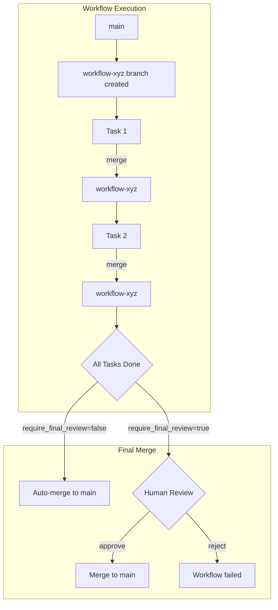

# Workflow Diff Review

The Workflow Diff Review feature provides workflow-level git branch isolation and an optional human review gate before final merge to the main branch.

## Overview

Previously, each task's work merged directly to `main` immediately upon completion. This had two issues:

1. **Partial work on main**: Incomplete work affected `main` before the workflow finished
2. **No consolidated review**: No opportunity to review all changes together before landing

The Workflow Diff Review feature addresses these by:

1. **Workflow Branch Isolation**: Every workflow creates a dedicated branch from `main` at start. All task merges target this workflow branch, keeping `main` clean until workflow completion.

2. **Optional Final Review Gate**: A `require_final_review` configuration flag controls whether the final merge requires human approval or happens automatically.

## How It Works

### Workflow Lifecycle



### State Transitions

| Status | Description |
|--------|-------------|
| `active` | Workflow in progress, tasks running and merging to workflow branch |
| `pending_final_review` | All tasks done, awaiting human review of consolidated diff |
| `completed` | Final merge to main succeeded (manual or auto) |
| `failed` | Workflow rejected or encountered unresolvable issues |

## Configuration

### Enable Review Gate

In `hephaestus_config.yaml`:

```yaml
git:
  require_final_review: true    # Enable the review gate (default: false)
  workflow_branch_prefix: "workflow-"  # Branch naming prefix (default: "workflow-")
```

### Configuration Options

| Option | Type | Default | Description |
|--------|------|---------|-------------|
| `require_final_review` | boolean | `false` | When `true`, workflows pause for human review after all tasks complete |
| `workflow_branch_prefix` | string | `"workflow-"` | Prefix for workflow branch names |

## Workflow Branch Behavior

### Branch Creation

When a workflow starts:

1. A new branch is created from `main` named `{prefix}{workflow_id[:8]}`
2. The workflow record stores `workflow_branch_name` and `workflow_branch_created=true`
3. The `final_merge_status` is set based on `require_final_review`:
   - `not_applicable` if auto-merge (no review needed)
   - `pending_review` if review is required

### Task Merges

When tasks complete:

1. Task work merges to the **workflow branch**, not `main`
2. Each subsequent task branches from the workflow branch (inheriting prior work)
3. The main branch remains untouched during workflow execution

### Final Merge

When all tasks are done:

**If `require_final_review=false`:**
- Workflow branch auto-merges to `main`
- Workflow status becomes `completed`
- `final_merge_commit_sha` is populated

**If `require_final_review=true`:**
- Workflow status becomes `pending_final_review`
- User reviews consolidated diff via UI
- User approves or rejects the merge

## API Endpoints

### Get Workflow Diff

Retrieve the consolidated diff between main and the workflow branch:

```
GET /api/workflow/{workflow_id}/final-diff
```

**Response:**
```json
{
  "files_changed": [
    {"path": "src/feature.py", "status": "modified", "additions": 50, "deletions": 10},
    {"path": "tests/test_feature.py", "status": "added", "additions": 100, "deletions": 0}
  ],
  "stats": {
    "files_changed": 2,
    "insertions": 150,
    "deletions": 10
  },
  "commits": [
    {"sha": "abc123", "message": "Implement feature", "author": "agent-1"},
    {"sha": "def456", "message": "Add tests", "author": "agent-2"}
  ],
  "diff_content": "..."
}
```

### Approve Merge

Approve and execute the final merge to main:

```
POST /api/workflow/{workflow_id}/approve-merge
```

**Request Body:**
```json
{
  "reviewed_by": "username"
}
```

**Response:**
```json
{
  "success": true,
  "workflow_id": "...",
  "status": "completed",
  "final_merge_status": "merged",
  "final_merge_commit_sha": "abc123def456...",
  "merged_at": "2025-01-13T10:30:00Z"
}
```

### Reject Merge

Reject the workflow changes:

```
POST /api/workflow/{workflow_id}/reject-merge
```

**Request Body:**
```json
{
  "reviewed_by": "username",
  "reason": "Changes need revision",
  "delete_branch": false
}
```

**Response:**
```json
{
  "success": true,
  "workflow_id": "...",
  "status": "failed",
  "final_merge_status": "rejected",
  "branch_deleted": false
}
```

## UI Workflow

### Review Status Indicator

When `require_final_review=true`, workflows that complete all tasks show:
- Status badge: "Awaiting Final Review"
- "Review Diff" button to open the review modal

### Diff Review Modal

The modal displays:
- List of files changed with add/modify/delete indicators
- Overall statistics (insertions, deletions, files changed)
- Commit history on the workflow branch
- Full unified diff viewer
- Approve and Reject buttons

### Approve Flow

1. Click "Review Diff" on a `pending_final_review` workflow
2. Review the consolidated changes
3. Click "Approve & Merge"
4. Confirm the merge
5. Workflow status updates to `completed`

### Reject Flow

1. Click "Review Diff" on a `pending_final_review` workflow
2. Review the consolidated changes
3. Click "Reject"
4. Optionally provide rejection reason
5. Workflow status updates to `failed`
6. Branch is preserved for manual recovery (unless deleted)

## Database Schema

The Workflow model includes these fields for diff review:

| Field | Type | Description |
|-------|------|-------------|
| `workflow_branch_name` | String | Name of the workflow's dedicated branch |
| `workflow_branch_created` | Boolean | Whether the branch has been created |
| `final_merge_status` | Enum | `not_applicable`, `pending_review`, `approved`, `merged`, `rejected` |
| `final_merge_reviewed_at` | DateTime | When the review decision was made |
| `final_merge_reviewed_by` | String | Who made the review decision |
| `final_merge_commit_sha` | String | The merge commit SHA after approval |

## Edge Cases

### Main Branch Diverges

If `main` changes during workflow execution:
- Task merges continue to the workflow branch
- Final merge may encounter conflicts
- Auto-merge uses existing conflict resolution strategy
- If unresolvable, workflow pauses for manual intervention

### Abandoned Workflows

Workflows that stall without completion:
- Branch remains in the repository
- Can be manually resumed or rejected
- Future: retention policy for cleanup

### Partial Failure

If a workflow fails mid-execution:
- Workflow branch contains partial work
- Can be manually completed, rejected, or resumed
- Branch preserves work for recovery

### Concurrent Workflows

Multiple workflows modifying the same files:
- First workflow to merge wins
- Subsequent workflows may see conflicts at final merge
- Conflict resolution follows existing strategy

## Backward Compatibility

Workflows created before this feature (no `workflow_branch_name`) continue to work:
- Tasks merge directly to main (legacy behavior)
- No review gate is applied
- Completion works as before

## Troubleshooting

### Workflow Stuck in pending_final_review

**Cause**: All tasks complete but merge wasn't approved/rejected.

**Solution**: 
- Review via UI and approve/reject
- Or use API to programmatically approve/reject

### Merge Conflicts at Final Merge

**Cause**: Main branch diverged during workflow execution.

**Solution**:
- Auto-merge attempts conflict resolution
- If unresolvable, manually resolve on the workflow branch
- Then re-approve the merge

### Branch Not Created

**Cause**: Workflow started before branch creation code or error during creation.

**Solution**:
- Check workflow record for `workflow_branch_created=false`
- Workflow will complete via legacy path (direct to main)

## Testing

Run the integration tests:

```bash
python tests/test_workflow_diff_review.py
```

Tests cover:
- Workflow branch creation
- Task merges to workflow branch
- Auto-merge on completion
- Review gate behavior
- Approve/reject endpoints
- Legacy workflow compatibility
